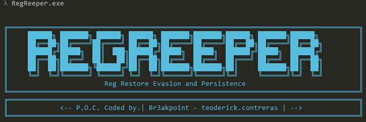
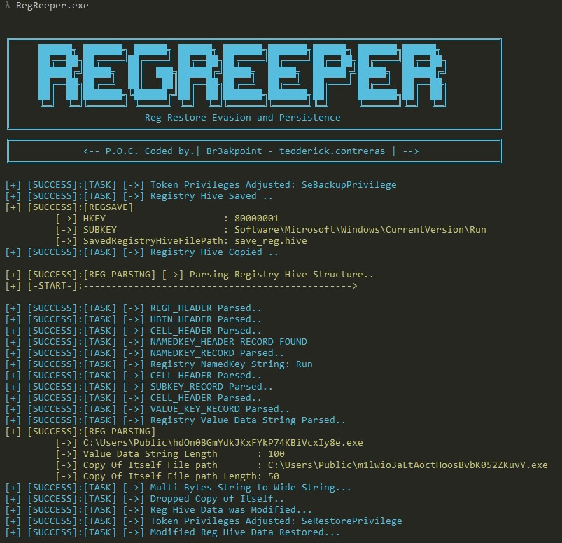

# RegReeper 

 </img>

## Reg Restore Evasion and Persistence
This short C code presents a Proof of Concept (POC) designed to achieve persistence and evade Sysmon event monitoring for registry actions such as key creation, update, and deletion, specifically targeting the REG_NOTIFY_CLASS Registry Callback in the Sysmon driver filter. To bypass monitoring, the POC leverages the RegSaveKeyExW() and RegRestoreKeyW() APIs, which are not included (as of writing) in sysmon monitoring or in REG_NOTIFY_CLASS type of registry callback of Sysmon driver filter.

By utilizing these APIs, the POC can create backups of registry keys using RegSaveKeyExW() and later restore them using RegRestoreKeyW(), effectively evading detection by Sysmon. It's essential to recognize that this POC serves only as a demonstration of a potential technique for achieving persistence and evading monitoring and should be used solely for educational or research purposes, refraining from any malicious intent or illegal activities.


## POC GOAL 
modify the existing registry entry in ```HKCU\Software\\Microsoft\\Windows\\CurrentVersion\\Run``` using RegSave and Regstore API to gain persistence in targeted host. 

notes: this poc needs an admin privileges to execute properly

## POC Use Case
1. Adjust Token Privilege ```SeBackupPrivilege``` to be able to save ```HKCU\\Software\\Microsoft\\Windows\\CurrentVersion\\Run``` registry hive.
2. saved the registry hive to "save_reg.hive"
3. Parse registry hive structure (```save_reg.hive```)  to look for registry value key data string to be modify
4. compute the length of the registry value key data string found during parsing to generate random file name.
5. dropped copy of itself in ```c:\users\public\{random_filename}.exe```
6. create a copy of ```save_reg.hive``` -> ```mod_save_reg.hive```
7. modify the current registry value key data string of  ```HKCU\\Software\\Microsoft\\Windows\\CurrentVersion\\Run``` with the file path of its file copy.
8. Adjust Token Privilege to ```SeRestorePrivilege```
9. trigger RegRestore via ```RegRestoreKeyW()``` API.

# HOW To Build
- clone the project and build it using Visual Studio (tested with VS 2019)

## POC Example

 </img>
   
